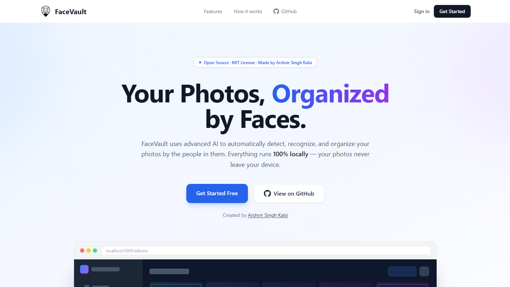
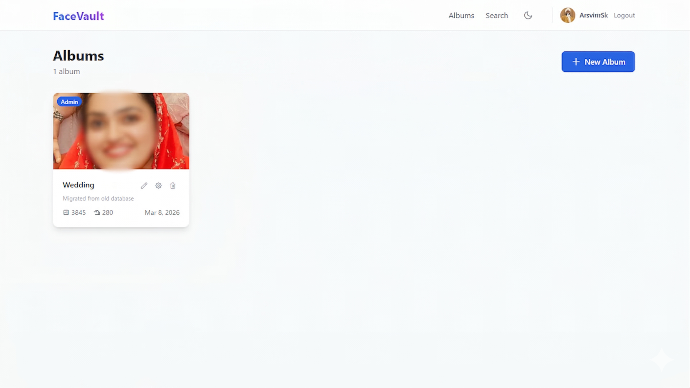
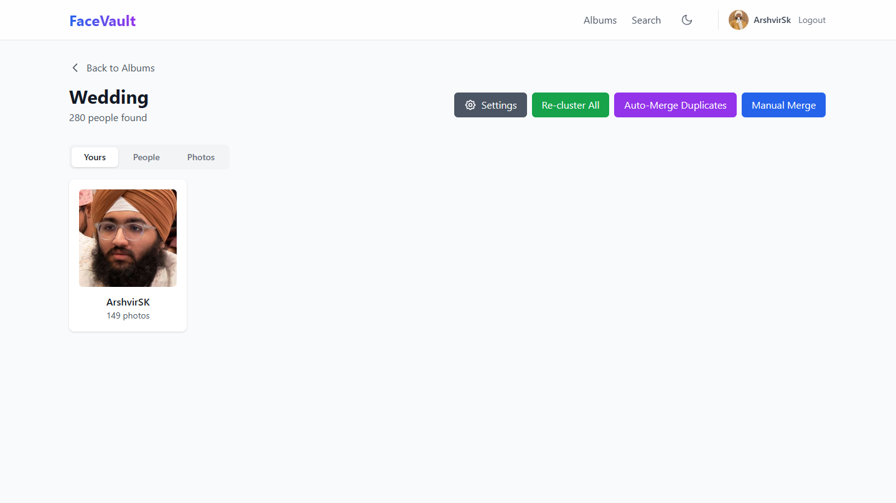
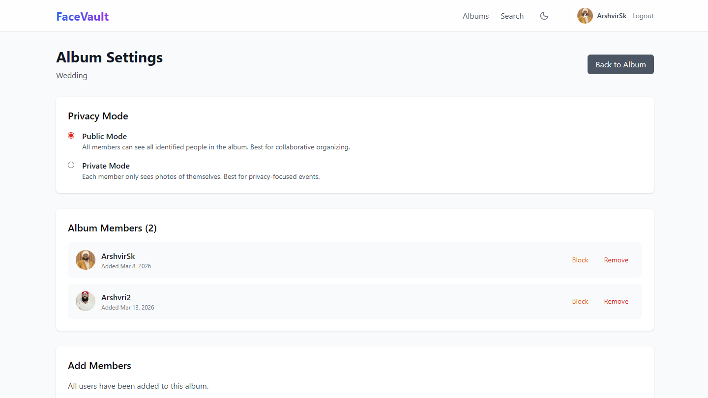
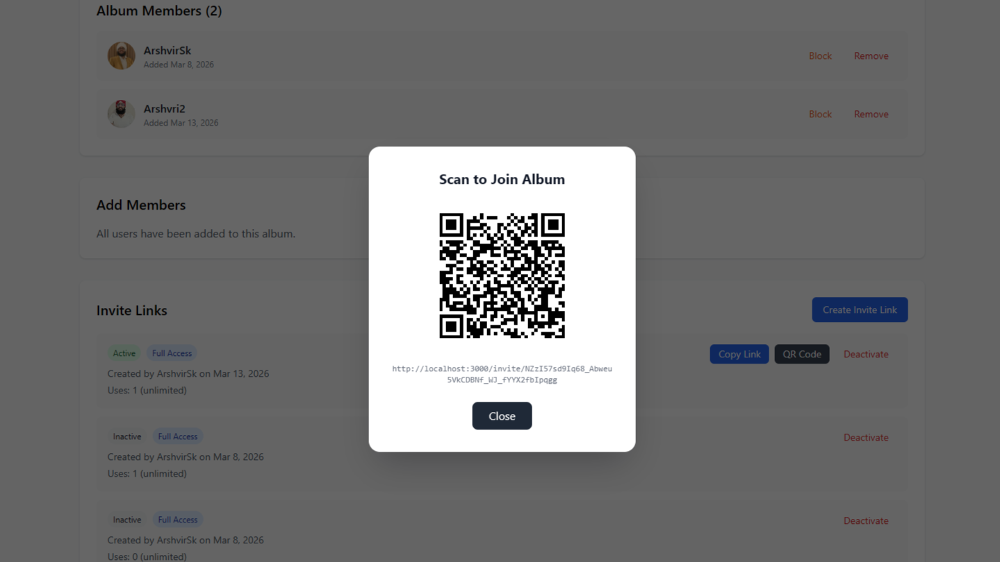
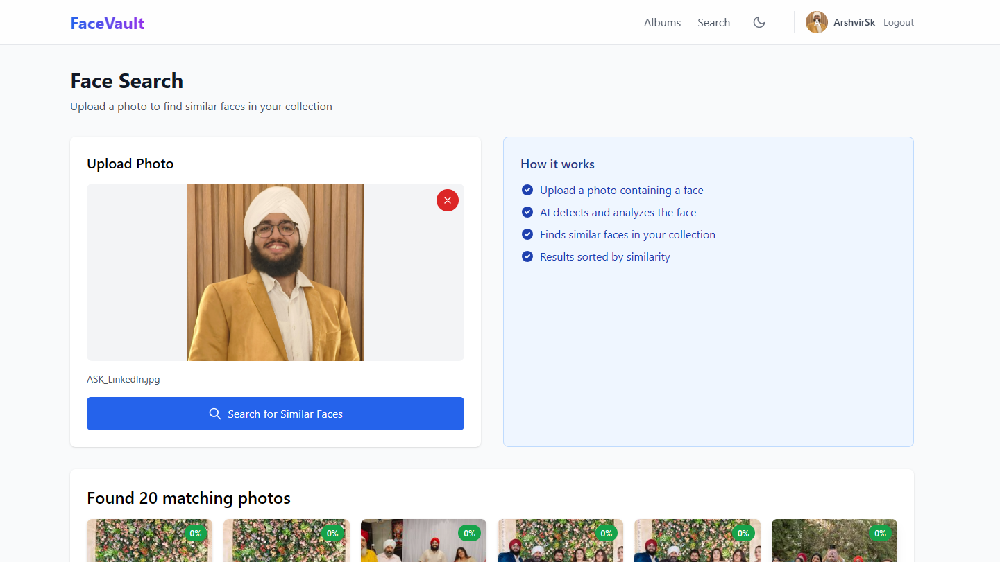

# FaceVault - AI-Powered Private Photo Organizer | 100% Local, Zero Cloud

<div align="center">


[](https://www.python.org/)
[](https://fastapi.tiangolo.com/)
[](https://nextjs.org/)
[](https://react.dev/)
[](https://www.typescriptlang.org/)
[](LICENSE)

</div>

---

## ✨ What is FaceVault?

FaceVault is a self-hosted, privacy-first photo management system. It uses state-of-the-art AI (InsightFace + FAISS) to automatically:

- 🔍 **Detect every face** in your photo library
- 🧠 **Recognize and cluster** faces by person — no labeling required
- 📂 **Organize photos by people**, with smart deduplication
- 🔎 **Search your entire library** by uploading any face photo
- 👥 **Share albums** with friends and family via invite links

Everything happens **locally**. No accounts with third parties, no subscriptions, no cloud uploads.

---

## 🖼️ Screenshots

### Page-wise tour

#### Landing

Quick marketing splash with CTA to get started or jump into albums.


#### Albums dashboard

All albums with stats and quick actions.


#### New Album modal

Pick a folder path (local to the backend host) and optional album name.


#### Yours tab

Auto-finds your face across the album and shows your photos only.


#### Photos tab

Flat grid with sort and person filters.


#### Photos tab — grouped (Day/Month)

Toggle grouping to browse by day or month.


#### Album settings

Privacy mode, members list, and admin actions.


#### Invite via QR

Share an invite link as a QR code for quick mobile onboarding.


#### Face Search

Upload any photo to instantly find matching faces across all your albums.


> **Tip:** Need updated visuals? Open the app, take fresh screenshots, and save them in `screenshots/`.

---

## 🚀 Setup

### Prerequisites

| Tool | Version | Notes |
|------|---------|-------|
| Python | 3.10.x | Tested with **3.10.11**; 3.10+ required |
| Node.js | 18.17+ | Required for Next.js 15 |
| npm | 9+ | Comes with Node.js |
| Git | any | To clone the repo |

> **GPU support**: Runs on CPU by default. For GPU acceleration, replace `onnxruntime` with `onnxruntime-gpu` in `requirements.txt` and install CUDA.

> **Python version**: The virtual environment was created with Python **3.10.11**. Using a different minor version (3.11, 3.12) may work but is untested. Stick to 3.10.x for guaranteed compatibility with all pinned packages.

---

### 1. Clone the repo

```bash
git clone https://github.com/ArshvirSk/FaceVault.git
cd FaceVault
```

---

### 2. Backend

```bash
cd backend

# Create and activate a virtual environment
python -m venv .venv
.venv\Scripts\activate        # Windows
source .venv/bin/activate     # macOS / Linux

# Install dependencies (~2–5 min; AI models download on first run)
pip install -r requirements.txt
```

> On first run, InsightFace downloads the `buffalo_l` model (~500 MB) to `~/.insightface/`. This only happens once.

---

### 3. Frontend

Open a **second terminal**:

```bash
cd frontend
npm install
```

---

### 4. Choose your setup mode

Pick the scenario that matches how you want to run FaceVault:

---

#### 💻 Option A — Localhost (just you, one machine)

No configuration needed. Start both servers and go:

```bash
# Terminal 1 — backend
cd backend && uvicorn main:app --reload

# Terminal 2 — frontend
cd frontend && npm run dev
```

| | URL |
|---|---|
| Web app | <http://localhost:3000> |
| API | <http://localhost:8000> |
| API docs | <http://localhost:8000/docs> |

---

#### 📡 Option B — Local Network (share with others on the same Wi-Fi)

Run the servers on your machine; anyone on the same network can open the app on their phone or laptop.

**Step 1 — find your machine's local IP**

```bash
# Windows
ipconfig
# macOS / Linux
ip a
# Look for something like 192.168.1.42
```

**Step 2 — configure environment variables**

```bash
# backend/.env  (copy from backend/.env.example)
FRONTEND_URL=http://192.168.1.42:3000

# frontend/.env.local  (copy from frontend/.env.local.example)
NEXT_PUBLIC_API_URL=http://192.168.1.42:8000
```

**Step 3 — start servers bound to all interfaces**

```bash
# Terminal 1 — backend
cd backend && uvicorn main:app --host 0.0.0.0 --port 8000 --reload

# Terminal 2 — frontend
cd frontend && npm run dev
```

Other devices on the same Wi-Fi open **`http://192.168.1.42:3000`** — done.

> **Note:** Photos are scanned from the *server machine's* file system. The folder path you enter in the app is local to wherever the backend is running.

---

#### 🌐 Option C — Self-hosted / Custom Domain

For running on a VPS, home server, or behind a reverse proxy (nginx, Caddy, etc.).

**Environment variables**

```bash
# backend/.env
FRONTEND_URL=https://facevault.example.com

# frontend/.env.local
NEXT_PUBLIC_API_URL=https://api.facevault.example.com
```

**Build the frontend for production**

```bash
cd frontend
npm run build
npm start          # runs on port 3000 by default
```

**Start the backend**

```bash
cd backend
uvicorn main:app --host 0.0.0.0 --port 8000
```

Then point your reverse proxy at port `3000` (frontend) and `8000` (backend API).

> **HTTPS note:** If your domain uses HTTPS, both `FRONTEND_URL` and `NEXT_PUBLIC_API_URL` must use `https://`. Browsers block mixed content (HTTPS page → HTTP API).

---

### 5. First run

1. Open the web app URL for your chosen setup
2. Click **Register** — create your account with a profile photo *(used for face matching)*
3. Click **New Album** → enter a name and a local folder path containing photos
4. Watch the real-time progress bar as FaceVault scans, detects, and clusters faces
5. Browse **People**, view photos, rename people, and search by face

---

## 🗺️ Feature Overview

### Albums

| Feature | Description |
|---------|-------------|
| **Create albums** | Scan any local folder — recursive, SHA-256 duplicate-safe |
| **Upload photos** | Drag-and-drop or file picker directly in the browser |
| **3-tab view** | **Yours** (your face only), **People** (all people, admin), **Photos** (full gallery) |
| **Photo filters** | Sort by newest / oldest / filename; filter by person |
| **Invite links** | Share albums via tokenized URLs with optional expiry + use limits |
| **QR code invites** | One-click QR code for mobile sharing |
| **Privacy mode** | Lock an album so members only see photos they appear in |
| **Role management** | Admin / member roles; transfer admin ownership; block / unblock |
| **Leave album** | Non-admins can leave at any time |

### People

| Feature | Description |
|---------|-------------|
| **Auto-clustering** | HDBSCAN groups faces into person clusters — no manual tagging |
| **Rename people** | Give anyone a persistent name |
| **Manual merge** | Select multiple person cards → merge into one |
| **Auto-merge** | Configurable similarity threshold; live slider with difficulty label |
| **Re-cluster** | Re-run clustering with updated parameters |
| **Face thumbnails** | Cropped, centered face previews for instant recognition |
| **Sort & filter** | Sort by photo count, A–Z, Z–A; search by name |

### Photo Viewer

| Feature | Description |
|---------|-------------|
| **Lightbox** | Full-screen viewer with smooth transitions |
| **Keyboard nav** | ← → arrow keys; Escape to close |
| **Preloading** | Next / prev photos preloaded for instant navigation |
| **Image metadata** | Filename, dimensions, file size, format |
| **Download** | Single photo or entire person collection as ZIP |
| **People in photo** | See all detected people in the current photo |

### Face Search

| Feature | Description |
|---------|-------------|
| **Upload any photo** | Upload a face image to find matches across all albums |
| **Similarity scores** | Results ranked by distance with percentage score |
| **Album context** | Each result shows which album it belongs to |
| **FAISS index** | Sub-100 ms vector search over tens of thousands of faces |

### Auth & Access

| Feature | Description |
|---------|-------------|
| **User accounts** | Username + password, bcrypt hashed |
| **Profile photos** | Uploaded on registration; used for "Yours" face matching |
| **Session cookies** | 7-day persistent sessions stored in SQLite |
| **Route protection** | All pages require authentication; invite flow handles redirect |

---

## 🏗️ Architecture

```
FaceVault/
├── backend/                      # Python / FastAPI
│   ├── main.py                   # All API routes (auth, albums, people, photos, search)
│   ├── scanner.py                # Recursive folder scanner + SHA-256 dedup
│   ├── detector.py               # InsightFace: face detection + ArcFace embeddings
│   ├── embedder.py               # Embedding extraction helpers
│   ├── cluster.py                # HDBSCAN clustering + noise handling
│   ├── search.py                 # FAISS L2 index for similarity search
│   ├── database.py               # SQLite — all schema + queries
│   └── requirements.txt
│
├── frontend/                     # Next.js 15 / React 19 / TypeScript
│   └── app/
│       ├── landing.tsx           # Marketing landing page
│       ├── albums/               # Albums list + create/scan modal
│       │   └── [id]/
│       │       ├── page.tsx              # Album detail (3-tab view)
│       │       └── settings/page.tsx    # Members, invites, privacy
│       ├── people/page.tsx       # Global people gallery
│       ├── person/[id]/page.tsx  # Person detail + photo lightbox
│       ├── search/page.tsx       # Face search
│       ├── auth/                 # Login + Register
│       ├── invite/[token]/       # Invite acceptance flow
│       └── api/                  # Next.js proxy routes (avoids CORS on images)
│           ├── photo/[photoId]/
│           ├── person/[personId]/face-thumbnail/
│           └── profile-photo/[userId]/
│
└── data/                         # Runtime data (git-ignored)
    ├── facevault.db              # SQLite database
    ├── cache/                    # Thumbnail cache
    ├── profile_photos/           # User profile photos
    └── uploads/                  # Photos uploaded via browser
```

### AI Pipeline

```
📸 Photo Input
    ↓
🔍 RetinaFace Detection  (InsightFace — finds every face bounding box)
    ↓
🧬 ArcFace Embedding     (InsightFace buffalo_l — 512-dim vector per face)
    ↓
🗂️  HDBSCAN Clustering   (groups vectors → person clusters, handles noise)
    ↓
🔎 FAISS L2 Index        (sub-100 ms similarity search)
    ↓
💾 SQLite Storage        (photos / faces / persons / albums / sessions)
```

---

## 🛠️ Tech Stack

| Layer | Technology |
|-------|-----------|
| API server | FastAPI 0.115 + Uvicorn |
| Face AI | InsightFace (`buffalo_l` — RetinaFace + ArcFace) |
| ML inference | ONNX Runtime |
| Clustering | HDBSCAN |
| Vector search | FAISS (CPU) |
| Database | SQLite |
| Image processing | OpenCV + Pillow |
| Frontend | Next.js 15 + React 19 |
| Styling | Tailwind CSS 3 |
| State / data fetching | TanStack React Query v5 |
| HTTP client | Axios |
| Languages | Python 3.10.11 · TypeScript 5.7 |

---

## 📦 Dependencies

### Backend (`backend/requirements.txt`) — Python 3.10.11

| Package | Version | Role |
|---------|---------|------|
| `fastapi` | 0.115.0 | Async REST API framework |
| `uvicorn` | 0.32.0 | ASGI server to run FastAPI |
| `python-multipart` | 0.0.12 | Multipart form data / file uploads |
| `opencv-python` | 4.10.0.84 | Image decoding, resizing, face crop |
| `torch` | 2.6.0 | PyTorch — ML tensor runtime used by InsightFace |
| `torchvision` | 0.21.0 | Vision utilities paired with PyTorch |
| `insightface` | 0.7.3 | RetinaFace detection + ArcFace embeddings (`buffalo_l`) |
| `onnxruntime` | 1.20.1 | ONNX inference backend for InsightFace models |
| `scikit-learn` | ≥1.6.0 | UMAP / preprocessing used by HDBSCAN |
| `hdbscan` | 0.8.41 | Density-based face clustering |
| `faiss-cpu` | 1.9.0.post1 | FAISS L2 vector index for face similarity search |
| `numpy` | 1.26.4 | Numerical arrays, embedding math |
| `Pillow` | 10.4.0 | Image format handling and thumbnail generation |
| `aiosqlite` | 0.20.0 | Async SQLite driver |
| `bcrypt` | 4.1.2 | Password hashing |

> Replace `onnxruntime` with `onnxruntime-gpu` and install CUDA for GPU acceleration.

### Frontend (`frontend/package.json`) — Node.js 18.17+

| Package | Version | Role |
|---------|---------|------|
| `next` | ^15.1.0 | React framework — App Router, SSR, API routes |
| `react` | ^19.0.0 | UI library |
| `react-dom` | ^19.0.0 | React DOM renderer |
| `@tanstack/react-query` | ^5.62.0 | Server state management and caching |
| `@tanstack/react-virtual` | ^3.10.0 | Virtualised list/grid rendering for large photo sets |
| `axios` | ^1.7.0 | HTTP client for API calls |
| `qrcode.react` | ^4.2.0 | QR code generation for invite links |
| `tailwindcss` | ^3.4.0 | Utility-first CSS framework |
| `typescript` | ^5.7.0 | Static typing |
| `postcss` + `autoprefixer` | ^8.4 / ^10.4 | CSS processing pipeline |

---

## 📡 API Reference

Full interactive docs available at **<http://localhost:8000/docs>**.

### Auth

| Method | Path | Description |
|--------|------|-------------|
| `POST` | `/auth/register` | Register with username, password, profile photo |
| `POST` | `/auth/login` | Login, receive session cookie |
| `POST` | `/auth/logout` | Invalidate session |
| `GET` | `/auth/me` | Get current user info |

### Albums

| Method | Path | Description |
|--------|------|-------------|
| `GET` | `/albums` | List all accessible albums |
| `GET` | `/album/{id}` | Get single album |
| `GET` | `/album/{id}/photos` | List photos (`?sort=newest\|oldest\|filename&person_id=N`) |
| `GET` | `/album/{id}/members` | List members |
| `POST` | `/album/{id}/members` | Add member (admin only) |
| `DELETE` | `/album/{id}/members/{uid}` | Remove member (admin only) |
| `POST` | `/album/{id}/leave` | Leave album |
| `POST` | `/album/{id}/upload` | Upload photos (multipart) |
| `POST` | `/scan` | Scan a local folder (SSE streaming progress) |

### People & Faces

| Method | Path | Description |
|--------|------|-------------|
| `GET` | `/people` | List all persons (`?album_id=N`) |
| `GET` | `/person/{id}/photos` | Photos for a person |
| `POST` | `/person/{id}/rename` | Rename a person |
| `POST` | `/person/{src}/merge/{target}` | Merge two persons |
| `POST` | `/auto-merge` | Auto-merge by threshold (`?threshold=0.5`) |
| `POST` | `/recluster` | Re-cluster all faces |
| `GET` | `/person/{id}/face-thumbnail` | Cropped face image (`?size=N`) |
| `GET` | `/person/{id}/photos/zip` | Download all photos as ZIP |

### Photos

| Method | Path | Description |
|--------|------|-------------|
| `GET` | `/photo/{id}` | Full-resolution image |
| `GET` | `/photo/{id}/thumbnail` | Cached thumbnail (`?size=N`) |
| `GET` | `/photo/{id}/metadata` | Filename, dimensions, file size |
| `GET` | `/photo/{id}/people` | People detected in this photo |
| `POST` | `/search-face` | Find similar faces by uploaded image |

### Invites

| Method | Path | Description |
|--------|------|-------------|
| `GET` | `/album/{id}/invites` | List invite links |
| `POST` | `/album/{id}/invites` | Create invite link (expiry + max uses) |
| `DELETE` | `/album/{id}/invites/{invite_id}` | Deactivate invite |
| `GET` | `/invite/{token}` | Get invite info (public) |
| `POST` | `/invite/{token}/join` | Accept invite, join album |

---

## ⚡ Performance Notes

- **First scan**: ~0.5–1 s/image on CPU (detection + ArcFace embedding)
- **Thumbnail loading**: disk-cached after first render → instant on repeat visits
- **Face search**: FAISS L2 index → < 100 ms for 10,000+ faces
- **Duplicate detection**: SHA-256 hash dedup — re-scanning the same folder is safe
- **Lazy loading**: IntersectionObserver with 800 px root margin — only in-view images load
- **React Query**: intelligent cache + background refetch — UI always feels fast

---

## 🔐 Privacy & Security

| | |
|---|---|
| ✅ **100% local processing** | All AI runs on your machine |
| ✅ **No cloud uploads** | Photos never leave your device |
| ✅ **No external API calls** | Zero third-party services involved |
| ✅ **No telemetry** | No analytics, no tracking, no beacon |
| ✅ **Bcrypt passwords** | Industry-standard password hashing |
| ✅ **Session expiry** | 7-day sessions, auto-cleaned on startup |
| ✅ **Open source** | Entire codebase is auditable |

---

## 🧩 Supported Photo Formats

`.jpg` · `.jpeg` · `.png` · `.webp`

---

## 🐛 Troubleshooting

### InsightFace model won't download

```bash
python -c "import insightface; insightface.app.FaceAnalysis(name='buffalo_l').prepare(ctx_id=0)"
```

### `onnxruntime` fails on Apple Silicon

```bash
pip install onnxruntime-silicon
```

### CORS errors in the browser

Make sure the environment variables match the actual URLs you're using:

- `frontend/.env.local` → `NEXT_PUBLIC_API_URL` must point to the backend
- `backend/.env` → `FRONTEND_URL` must point to the frontend

For localhost development neither file is needed — defaults apply automatically.

### Photos not loading after moving files

Run the orphan cleanup from the backend virtual environment:

```bash
python -c "
import sqlite3, os
db = sqlite3.connect('../data/facevault.db')
c = db.cursor()
c.execute('SELECT photo_id, file_path FROM photos')
missing = [r[0] for r in c.fetchall() if not os.path.exists(r[1])]
if missing:
    ph = ','.join('?'*len(missing))
    c.execute(f'DELETE FROM faces WHERE photo_id IN ({ph})', missing)
    c.execute(f'DELETE FROM photos WHERE photo_id IN ({ph})', missing)
    db.commit()
    print(f'Removed {len(missing)} orphaned photo records')
else:
    print('No orphaned photos found')
db.close()
"
```

### Duplicate people after re-scan

Use **Auto-Merge** (album detail → People tab) with threshold 0.45–0.50, or use **Manual Merge** to select and combine specific people.

---

## 🤝 Contributing

Contributions are very welcome! Please read [CONTRIBUTING.md](CONTRIBUTING.md) before opening a PR.

**Areas that would benefit most:**

- 🖥️ Docker Compose setup for one-command startup
- 🎞️ Video face detection support
- 📅 Timeline / date-based gallery view
- 🌍 Multi-language / i18n support
- 🏷️ Manual face tagging and corrections
- 🧪 Unit and integration tests
- 🖥️ GPU acceleration docs and config

---

## 📄 License

[MIT License](LICENSE) — free for personal and commercial use.

---

## 🙏 Acknowledgments

| Project | Role |
|---------|------|
| [InsightFace](https://github.com/deepinsight/insightface) | RetinaFace detection + ArcFace recognition |
| [FAISS](https://github.com/facebookresearch/faiss) | Billion-scale vector similarity search |
| [HDBSCAN](https://github.com/scikit-learn-contrib/hdbscan) | Robust density-based clustering |
| [FastAPI](https://fastapi.tiangolo.com/) | Modern async Python API framework |
| [Next.js](https://nextjs.org/) | React framework powering the frontend |
| [TanStack Query](https://tanstack.com/query) | Server-state management for React |

---

<div align="center">

Built with ❤️ by [Arshvir Singh Kalsi](https://github.com/ArshvirSk)

⭐ **Star this repo if you find it useful!**

</div>
